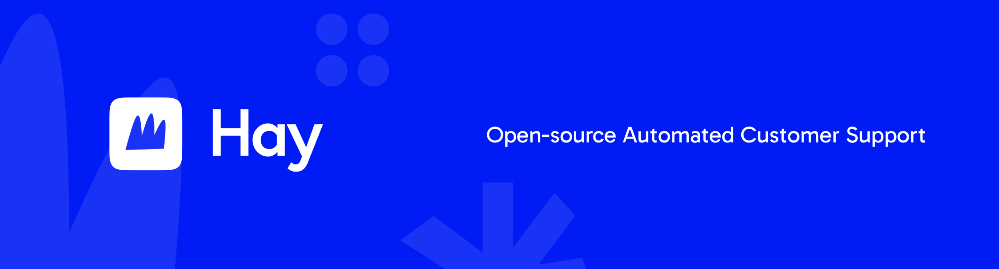

AI-powered customer support platform. Automate conversations with configurable AI agents, train them on your knowledge base, and integrate with your existing tools — all from a single dashboard.

[Website](https://hay.chat) · [Documentation](https://hay.chat/docs/technical/)


## What is Hay?

Hay lets businesses deploy AI agents that handle customer support 24/7 across multiple channels. Agents are grounded in your documentation, follow structured playbooks, and seamlessly escalate to humans when needed.

**Key capabilities:**

- **AI Agents** — Configure tone, instructions, and behavior. Test before deploying.
- **Knowledge Base** — Upload PDFs, Word docs, text, markdown, or import from URLs. Agents use vector search to ground answers in your content.
- **Playbooks** — Step-by-step workflows for specific scenarios (refunds, order lookups, greetings, etc.).
- **Multi-channel** — Web chat widget, WhatsApp, email, and more via plugins.
- **Human Handoff** — Automatic escalation with full conversation context.
- **Plugin Ecosystem** — Extend functionality with Stripe, HubSpot, Zendesk, WooCommerce, Magento, and more via MCP (Model Context Protocol).
- **Analytics** — Resolution rate, response time, customer satisfaction, and conversation insights.
- **Privacy** — GDPR-compliant data handling with DSAR support.

## Tech Stack

| Layer    | Technology                                          |
| -------- | --------------------------------------------------- |
| Frontend | Nuxt 3 (Vue 3), Tailwind CSS, shadcn-vue, Pinia     |
| Backend  | Express 5, tRPC v11, TypeORM                        |
| Database | PostgreSQL 16 + pgvector                            |
| Cache    | Redis 7                                             |
| AI       | OpenAI (GPT-4o, text-embedding-3-small)             |
| Auth     | JWT, API Keys, OAuth 2.0                            |
| Plugins  | Model Context Protocol (MCP)                        |
| Webchat  | Vue 3 embeddable widget (Vite)                      |
| Testing  | Vitest (frontend), Jest (backend), Playwright (E2E) |

## Project Structure

```
├── dashboard/          # Nuxt 3 frontend
├── server/             # Express + tRPC backend
├── webchat/            # Embeddable chat widget
├── plugins/
│   ├── core/           # Built-in plugins (email, stripe, hubspot, etc.)
│   └── custom/         # User-created plugins
├── packages/
│   ├── plugin-sdk/     # @hay/plugin-sdk
│   └── server-sdk/     # @hay/server-sdk
├── docs/               # Technical and user documentation
├── tests/              # Playwright E2E tests
└── docker-compose.yml  # PostgreSQL + Redis
```

## Getting Started

### Prerequisites

- Node.js >= 18
- npm >= 9
- Docker (for PostgreSQL and Redis)

### Setup

```bash
# Clone the repository
git clone <repo-url>
cd hay-core

# Start infrastructure
docker compose up -d

# Install dependencies
npm install

# Configure environment
cp .env.example .env
# Edit .env with your settings (see Environment Variables below)

# Run database migrations
cd server && npm run migration:run && cd ..

# Start development
npm run dev
```

The dashboard runs on `http://localhost:3000` and the API on `http://localhost:3001`.

### Environment Variables

| Variable                                                      | Required   | Description                    |
| ------------------------------------------------------------- | ---------- | ------------------------------ |
| `DB_HOST`, `DB_PORT`, `DB_USERNAME`, `DB_PASSWORD`, `DB_NAME` | Yes        | PostgreSQL connection          |
| `REDIS_HOST`, `REDIS_PORT`                                    | Yes        | Redis connection               |
| `JWT_SECRET`, `JWT_REFRESH_SECRET`                            | Yes        | Auth secrets (min 32 chars)    |
| `OPENAI_API_KEY`                                              | Yes        | OpenAI API key for AI features |
| `SMTP_HOST`, `SMTP_PORT`, `SMTP_USER`, `SMTP_PASSWORD`        | No         | Email sending                  |
| `BASE_DOMAIN`, `API_DOMAIN`, `DASHBOARD_DOMAIN`               | Production | Domain configuration           |

## Development

```bash
# Run everything
npm run dev

# Individual services
npm run dev:server        # Backend only (port 3001)
npm run dev:dashboard     # Frontend only (port 3000)
npm run dev:webchat       # Webchat widget

# Testing
npm run test              # All tests
npm run test:server       # Server tests (Jest)
npm run test:dashboard    # Dashboard tests (Vitest)

# Code quality
npm run lint              # Lint all code
npm run lint:fix           # Auto-fix lint issues
npm run typecheck         # TypeScript checks

# Database
npm run migration:run     # Run pending migrations
npm run migration:generate -- ./database/migrations/Name  # Generate migration
npm run migration:revert  # Revert last migration
```

## Architecture

### AI Orchestrator

The orchestrator processes conversations through a three-layer pipeline:

1. **Perception** — Analyzes user intent, sentiment, and language
2. **Retrieval** — Finds relevant playbooks and documents via vector similarity search
3. **Execution** — Generates responses using agent context, retrieved knowledge, and active plugins

A two-stage guardrail system protects response quality:

- **Stage 1**: Company interest protection — blocks harmful responses
- **Stage 2**: Fact grounding — validates claims against source documents

### Plugin System

Plugins extend Hay via the Model Context Protocol (MCP). Each plugin is loaded dynamically at runtime — the core never hardcodes plugin references.

**Core plugins:**

| Plugin      | Category   | Description                         |
| ----------- | ---------- | ----------------------------------- |
| Email       | Channel    | Send emails via SMTP                |
| HubSpot     | CRM        | Contacts, companies, deals, tickets |
| Magento     | E-commerce | Products, orders, customers         |
| Stripe      | Payments   | Customers, subscriptions, invoices  |
| WooCommerce | E-commerce | Products, orders, customers         |
| Zendesk     | Help desk  | Tickets, customers, workflows       |

See the [Plugin API docs](https://hay.chat/docs/technical/plugins/api-reference/) for the plugin development guide.

### Webchat Widget

Embed the chat widget on any website:

```html
<script>
  window.HayChat = {
    config: {
      organizationId: "your-org-id",
      baseUrl: "https://your-api-domain.com",
      // ePrivacy consent mode: no cookies/storage until the first user interaction
      consent: "strict",
      position: "right",
      theme: "blue",
      greetingMessage: "Hi! How can we help?",
    },
  };
</script>
<script src="https://your-cdn/webchat.js" async></script>
```

If you use a cookie banner, set `window.HayChat.config` only after the user accepts:

```html
<script>
  function onConsentAccepted() {
    window.HayChat = window.HayChat || {};
    window.HayChat.config = {
      organizationId: "your-org-id",
      baseUrl: "https://your-api-domain.com",
      consent: "strict",
    };
    const s = document.createElement("script");
    s.src = "https://your-cdn/webchat.js";
    s.async = true;
    document.head.appendChild(s);
  }
</script>
```

Features: real-time messaging, typing indicators, agent avatars, unread badge, i18n support, and custom context injection via `window.HayChat.addContext()`.

## Documentation

- [Overview](https://hay.chat/docs/technical/)
- [Architecture](https://hay.chat/docs/technical/architecture/)
- [Context API](https://hay.chat/docs/technical/context-api/)
- [Guardrails](https://hay.chat/docs/technical/guardrails/)
- [Plugin Getting Started](https://hay.chat/docs/technical/plugins/getting-started/)
- [Plugin API Reference](https://hay.chat/docs/technical/plugins/api-reference/)
- [Channel Architecture](https://hay.chat/docs/technical/plugins/channel-architecture/)
- [Contributing](https://hay.chat/docs/technical/contributing/orchestrator/)

## License

[Hay Community License v1.0](LICENSE) — free to use, modify, and deploy, but you may not sell the software itself or remove the "Powered by Hay" attribution from the chat widget. See the full [LICENSE](LICENSE) for details.
